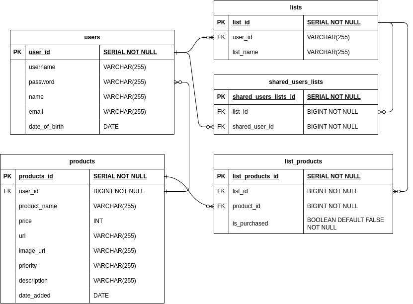
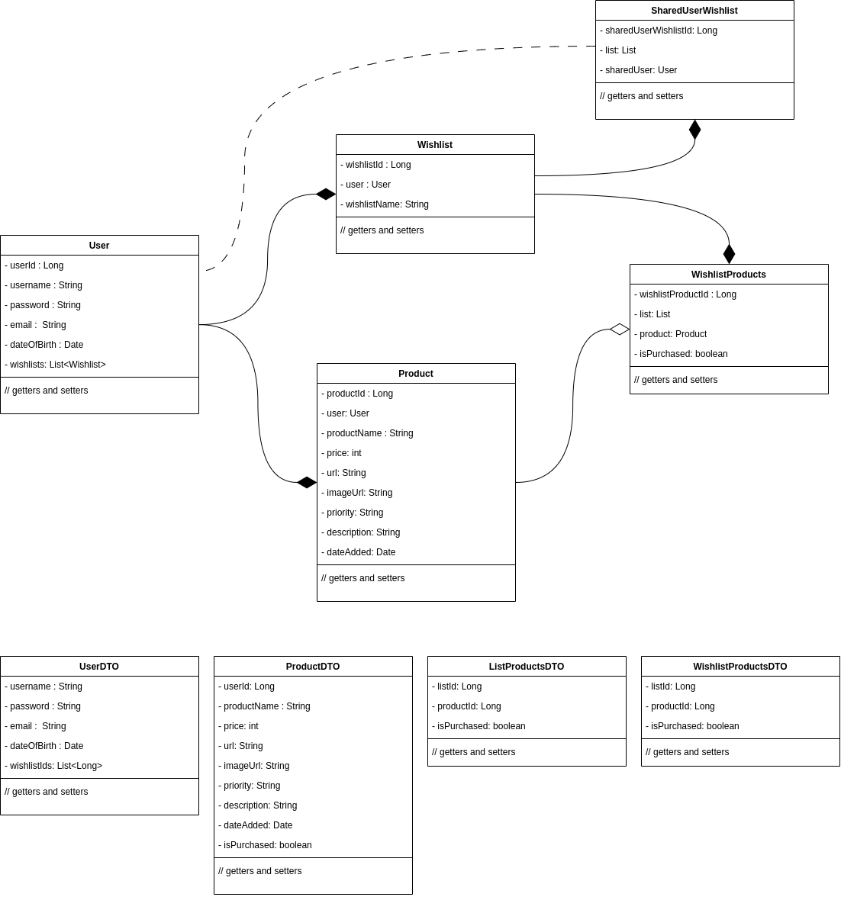
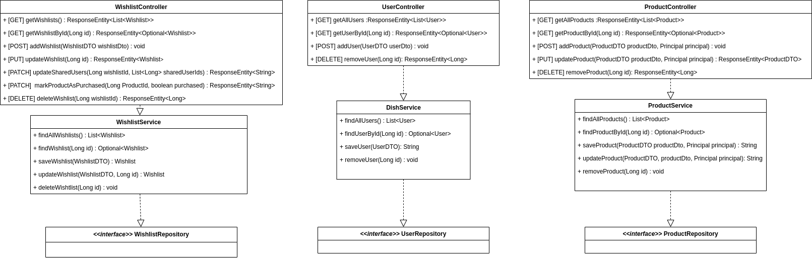

# Wishlister

## Table Of Contents

- [Description](#description)
- [MVP](#mvp)
- [Diagrams](#diagrams)
- [API Contract](#api-contract)
    * [Wishlist Endpoints](#wishlist-endpoints)

## Description
WishLister is a userEntity-friendly wishlist management application designed to make your gifting experience delightful and stress-free. Whether you're creating a wishlist for yourself or collaborating with friends and family, WishLister has you covered.

Key Features

  - Create Wishlists: Easily craft wishlists for any occasion, from birthdays to holidays.
  - Share and Collaborate: Share your wishlists with others and collaborate in real-time.
  - Customize Products: Add vivid details, images, and priority levels to personalize your wishlist items.
  - Stay Informed: Receive notifications for shared lists, new additions, and comments.
  - Explore Inspiration: Discover new gift ideas and explore wishlists from your inner circle.


## MVP
The MVP of this project is to allow userEntities to create and share their christmas wishlists with their friends and family.

User Management:
  
  - User registration: Allow userEntities to create accounts.
  - User authentication: Enable userEntities to log in securely.

List Management:
  
  - Create a new list: Users can create a wishlist.
  - View lists: Users can see their own lists.
  - Delete a list: Users can remove a list they no longer need.

Product Management:
  
  - Add a product: Users can add new products to their wishlist.
  - View products: Users can see a list of products in their wishlist.
  - Edit product details: Allow userEntities to update product information.

List-Product Relationship:
  
  - Add product to a list: Users can associate products with specific wishlists.
  - View products in a list: Users can see the products associated with a specific wishlist.

List Sharing:
  
  - Share a list: Users can share their wishlist with other userEntities.
  - View shared lists: Users can see lists shared with them.

Basic User Profile:
  
  - Display userEntity profile information: Show basic userEntity details.

## Diagrams

### ERD


### Class Diagrams


### API layers


## API Contract

## Wishlist Endpoints

### INDEX

```
Request
  URI: /wishlists
  HTTP Verb: GET
  Body: None
  Authorization: Only the list owner or userEntities with whom the list has been shared should be allowed.

Authorization Principles:
  List Owner Access: The authenticated userEntity must be the owner of the requested list.
  Shared User Access: The authenticated userEntity must be one of the userEntities with whom the list has been shared.

Response:
  HTTP Status:
    200 OK if the userEntity is authorized and the lists were successfully retrieved
    403 FORBIDDEN if the userEntity is unauthenticated or unauthorized
    404 NOT FOUND if the userEntity is authenticated and authorized but the lists cannot be found
  Response Body Type: JSON
  Example Response Body:
  [
    {
      "id": 1,
      "wishlistName": "Christmas 2023",
      "items": [
          {
            "id": 2,
            "productName": "iPhone 13",
            "price": 2459,
            "category": "Technology",
            "URL": "https://www.apple.com/uk/shop/buy-iphone/iphone-13",
            "imageURL": "http://localhost:8081/image-server/iphone-13",
            "priority": "must-have",
            "description": The iPhone 13, Apple's latest flagship smartphone, is a true marvel of technology and design. Featuring a stunning Super Retina XDR display, it delivers vibrant colors and sharp details for an immersive visual experience. The powerful A15 Bionic chip ensures smooth performance, making every task, from gaming to multitasking, a breeze.",
            "isPurchased": false"
          },
          ...
        ],
        "owner": {
          "username": "mike234"
          "name": "mike",
          "dob": 14-12-00,
          "email": "email@address.com"
        }
        "sharedUsers": [
          {
            "username": "janedoe123",
            "name": "Jane Doe",
            "dob": "05-22-89",
            "email": "jane@example.com"
          },
          ...
        }]
    },
    {
      "id": 2,
      "wishlistName": "Birthday Gifts",
      ...
    },
    {
        "id" : 3,
        ...
    }
  ]
```

### SHOW
```
Request
  URI: /wishlists/{wishlistId}
  HTTP Verb: GET
  Body: None
  Authorization: Only the list owner or userEntities with whom the list has been shared should be allowed.

Authorization Principles:
  List Owner Access: The authenticated userEntity must be the owner of the requested list.
  Shared User Access: The authenticated userEntity must be one of the userEntities with whom the list has been shared.

Response:
  HTTP Status:
    200 OK if the userEntity is authorized and the list was successfully retrieved
    403 FORBIDDEN if the userEntity is unauthenticated or unauthorized
    404 NOT FOUND if the userEntity is authenticated and authorized but the list cannot be found
  Response Body Type: JSON
  Example Response Body:
    {
      "id": 1,
      "wishlistName": "Christmas 2023",
      "items": [
          {
            "id": 2,
            "productName": "iPhone 13",
            "price": 2459,
            "category": "Technology",
            "URL": "https://www.apple.com/uk/shop/buy-iphone/iphone-13",
            "imageURL": "http://localhost:8081/image-server/iphone-13",
            "priority": "must-have",
            "description": The iPhone 13, Apple's latest flagship smartphone, is a true marvel of technology and design. Featuring a stunning Super Retina XDR display, it delivers vibrant colors and sharp details for an immersive visual experience. The powerful A15 Bionic chip ensures smooth performance, making every task, from gaming to multitasking, a breeze.",
            "isPurchased": false"
          },
          ...
        ],
        "owner": {
          "username": "mike234"
          "name": "mike",
          "dob": 14-12-00,
          "email": "email@address.com"
        }
        "sharedUsers": [
          {
            "username": "janedoe123",
            "name": "Jane Doe",
            "dob": "05-22-89",
            "email": "jane@example.com"
          },
          ...
        ]
    }
```
### CREATE
```
Request
  URI: /wishlists
  HTTP Verb: POST
  Authorization: Only the list owner or userEntities with whom the list has been shared should be allowed.
    Authorization Principles:
      List Owner Access: The authenticated userEntity must be the owner of the requested list.
      Shared User Access: The authenticated userEntity must be one of the userEntities with whom the list has been shared.
  Example Request Body: {
      "wishlistName": "24th Birthday"
    }

Response:
  HTTP Status:
    201 CREATED if the userEntity is authorized and the list was successfully created
    400 BAD REQUEST if the client's request is malformed or missing required parameters.
    403 FORBIDDEN if the userEntity is unauthenticated or unauthorized
    404 NOT FOUND if the userEntity is authenticated and authorized but the wishlist cannot be found

  Response Body Type: JSON
  Header: Location=/wishlists/42
```

### UPDATE
```
Request
    URI: /wishlists/{wishlistId}
    HTTP Verb: PUT
    Example Request Body:
    {
        "wishlistName": "New Birthday Retitled"
    }

Response:
    HTTP Status:
        200 OK if the wishlist has successfully been updated
        204 NO CONTENT if the wishlist has successfully been updated and no data needs to be sent back
        400 BAD REQUEST if the client's request is malformed of missing required parameters
        403 FORBIDDEN if the userEntity is unauthenticated of unauthorized
        404 NOT FOUND if the userEntity is authenticated and authorized but the wishlist cannot be found
        422 UNPROCESSABLE ENTITY if the request is well-formed but is unable to be followed because of semantic errors
        
    Response Body Type: JSON
    Example Request Body:
    {
        "status": "success",
        "message": "Wishlist successfully updated",
        "data": {
            "wishlistId": 1,
            "updatedAt": "2023-11-30T12:34:56Z"
        }
    }   
```

### UPDATE
```
Request:
    URI: /wishlists/{wishlistId}/shared-userEntities
    HTTP verb: PATCH
    Example Request Body:
    {
        "addedUserIds": [1, 2, 56, 190],
        "removedUserIds": [12, 13]
    }

Response:
    HTTP Status:
        200 OK if the shared userEntity list is updated
        404 NOT FOUND if the resource be that the shared userEntity list is not found
        409 CONFLICT if a userEntity specified for removal doesn't exist in the current shared userEntities list
        422 UNPROCESSABLE ENTITY
    Examples Response Body:
    {
      "status": "success",
      "message": "Shared userEntities list updated successfully",
      "data": {
        "wishlistId": 1,
        "updatedAt": "2023-11-30T12:34:56Z"
      }
    }
```

### UPDATE
```
Request: 
    URI: /wishlists/{wishlistId}/items/{itemId}
    HTTP verb: PATCH
    Example Request Body:
    {
        "itemId": 3,
        "isPurchased": true
    }

Response:
    HTTP Status:
        200 OK if the item is updated successfully
        404 NOT FOUND if the item is not found
        422 UNPROCESSABLE ENTITY
    Example Response Body:
    {
        "status": "success",
        "message": "Item updated successfully",
        "data": {
            "wishlistId": 2,
            "itemId": 345,
            "updatedAt": "2023-11-20T14:23:45Z"
        }
    }
```

### DELETE
```
Request:
    URI: /wishlists/{wishlistId}
    HTTP verb: DELETE
    Example Request Body: None

Response:
    HTTP Status:
        200 OK if the wishlist is deleted successfully
        404 NOT FOUND if the wishlist does not exist
    Example Response Body:
    {
        "status": "success",
        "message": "Wishlist deleted successfully",
        "data": null
    }
```
